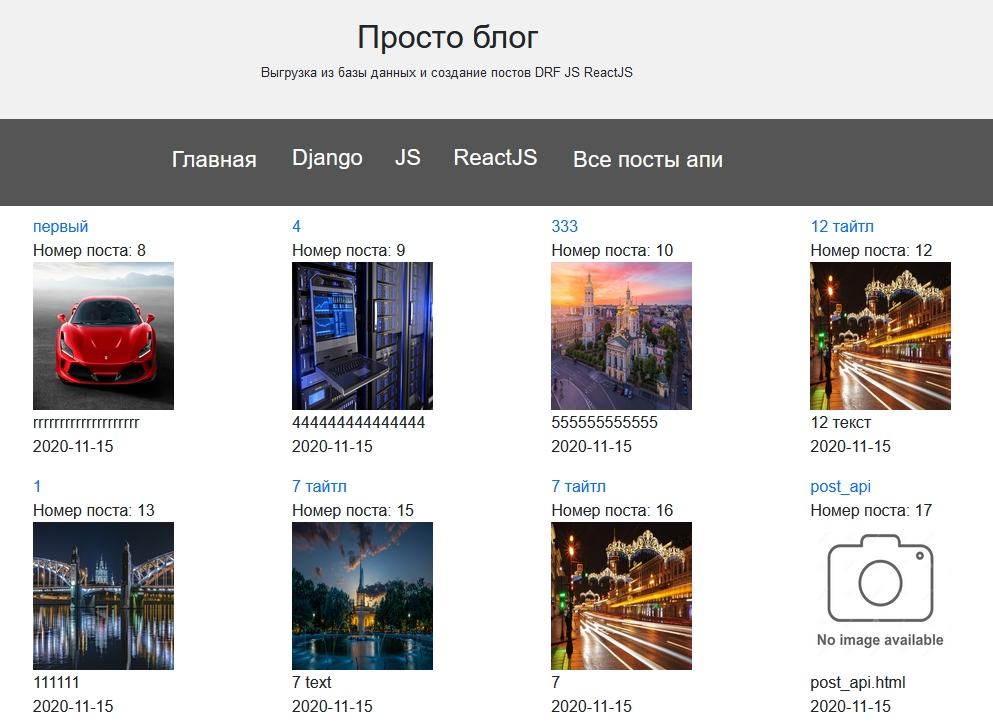

# BLOG
 - Django
- DRF 
- JS
- ReactJS
- AJAX(FETCH)

**Install**
- pip install requirements.txt

<h2>Простой блог</h2>

Посты можно:

     
- Удалить

    
- Отредактировать

    
- Добавить

Из админки, шаблона и JS ReactJS API

   